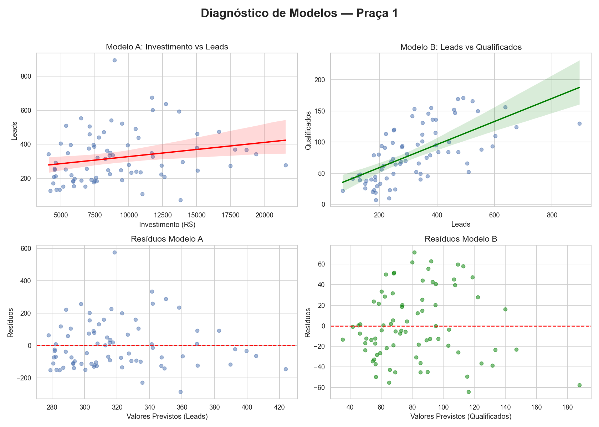
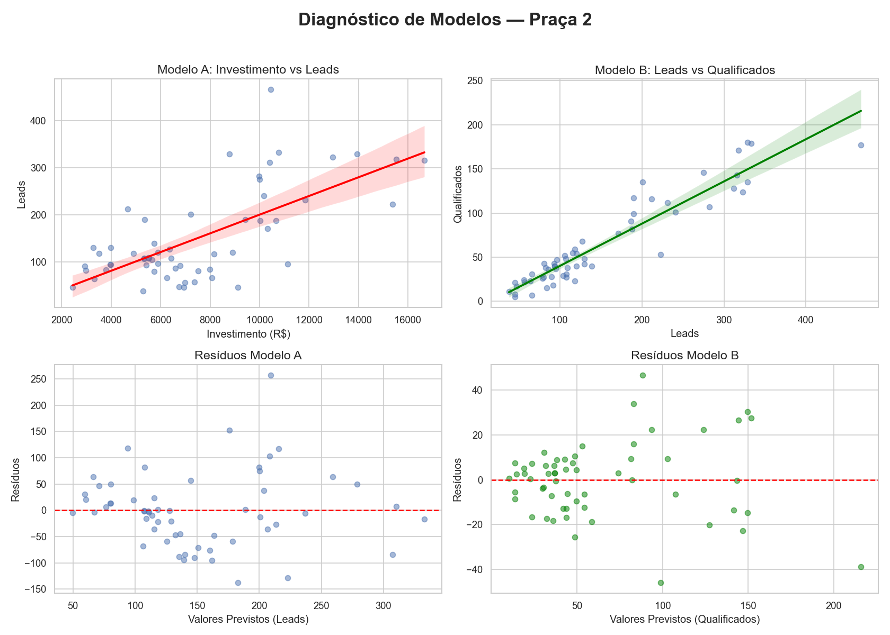
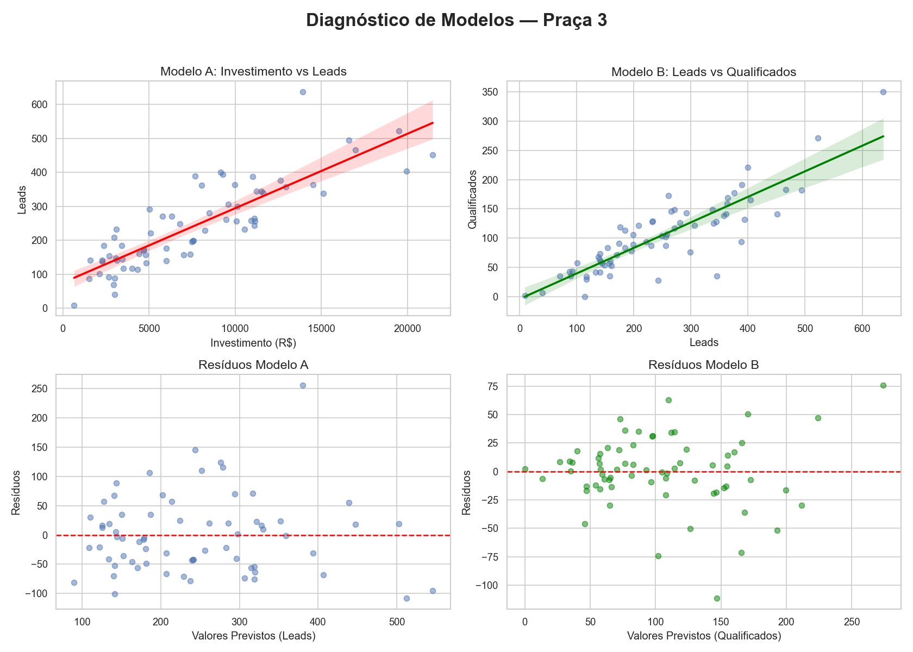
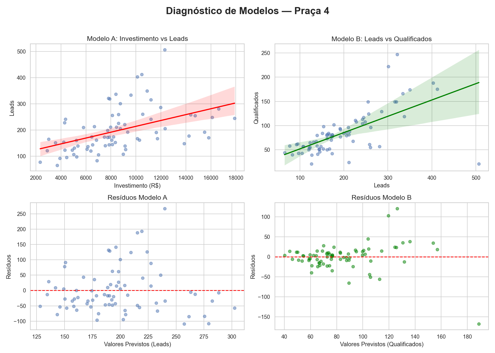
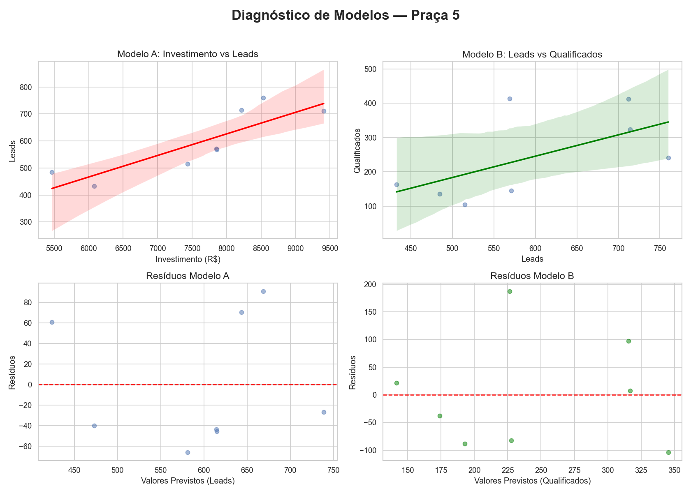
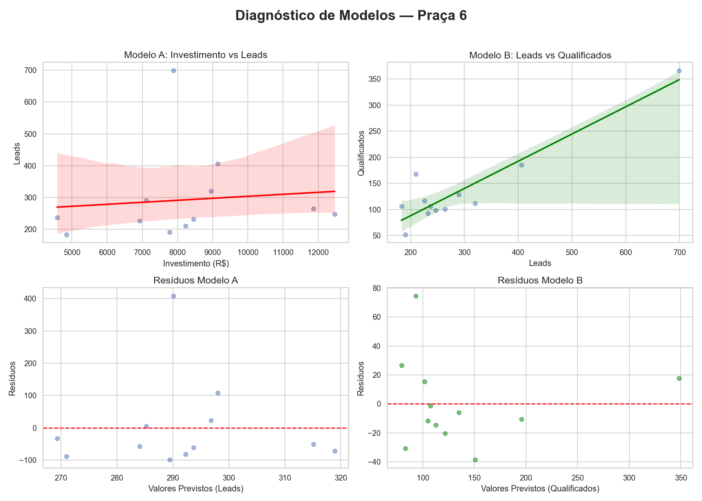

# Relatório 04 — Diagnóstico Estatístico Individual por Praça

> **Objetivo:** Auditar a linearidade (Pearson) e a variância dos resíduos (Breusch-Pagan) segmentados por região.

| Praça | Amostra (N) | Corr R (A) | BP p-valor (A) | Corr R (B) | BP p-valor (B) | Visualização |
|---|---|---|---|---|---|---|
| Praça 1 | 78 | 0.2216 | 0.6482 (✅ Hom) | 0.6351 | 0.0044 (⛔ Het) |  |
| Praça 2 | 58 | 0.6828 | 0.0959 (✅ Hom) | 0.9405 | 0.0001 (⛔ Het) |  |
| Praça 3 | 68 | 0.8486 | 0.0898 (✅ Hom) | 0.8697 | 0.0026 (⛔ Het) |  |
| Praça 4 | 75 | 0.4686 | 0.0726 (✅ Hom) | 0.6432 | 0.0000 (⛔ Het) |  |
| Praça 5 | 8 | 0.8523 | 0.8095 (✅ Hom) | 0.5931 | 0.7714 (✅ Hom) |  |
| Praça 6 | 12 | 0.1039 | 0.8994 (✅ Hom) | 0.9249 | 0.4776 (✅ Hom) |  |

## Conclusões Técnicas

- **Linearidade (R):** Valores próximos de 1 indicam forte relação linear. Praças com R baixo sugerem que outros fatores (como concorrência ou maturidade) pesam mais que o investimento.
- **Heterocedasticidade (BP):** Se p-valor < 0,05 (⛔ Het), a margem de erro aumenta conforme o volume cresce. Recomenda-se uso de intervalos de confiança.
- **Observação:** Algumas praças com amostras pequenas (N < 20) podem apresentar resultados menos estáveis nos testes de resíduos.