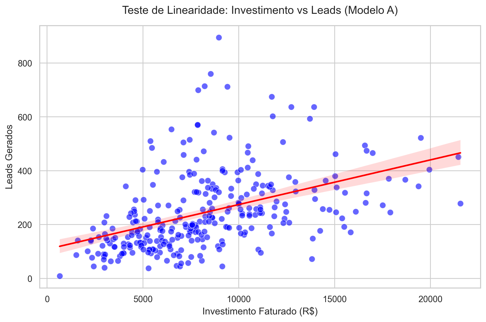
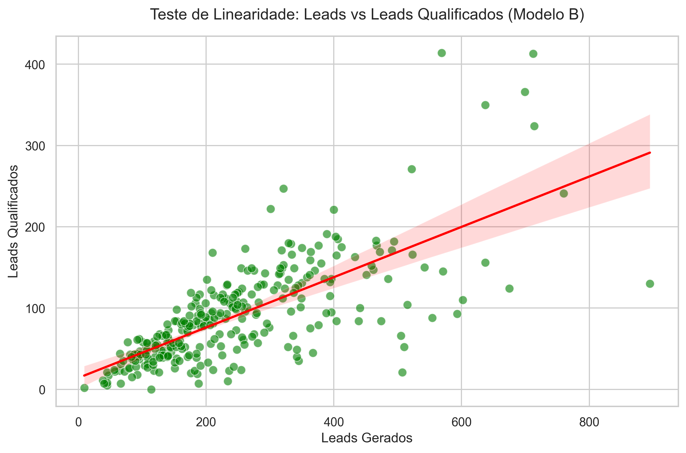

# Teste 01 — Linearidade entre Variáveis (X e Y)

**Objetivo:** Verificar se existe uma relação linear entre os preditores principais (X) e a variável alvo (Y) para os dois modelos. Isso justifica e valida a escolha do algoritmo de Regressão Linear.

---

## 1. Modelo A: Investimento (X) vs Leads (Y)

**Hipótese:** Um maior volume de investimento financeiro em mídia resulta em um maior volume de leads gerados.

### Metodologia
Foi gerado um gráfico de dispersão (`scatter plot`) plotando todos os registros da base ativa. Uma linha de tendência (Regressão Linear simples) foi ajustada sobre os pontos. Além disso, foi calculado o **Coeficiente de Correlação de Pearson**.

### Resultados Quantitativos
- **Correlação de Pearson (R):** `0.4457`

### Análise Visual

### Conclusão do Modelo A
A correlação positiva moderada (`0.4457`) comprova que **existe uma tendência linear de crescimento**: quanto mais se investe, mais leads são gerados. No entanto, a alta dispersão (pontos espalhados em torno da linha) evidencia que o investimento, de forma isolada, não explica toda a geração de leads. 
Por isso, a inclusão das variáveis `praca` (contexto regional) e `mes_ciclo` (maturidade do empreendimento) no modelo múltiplo é não apenas justificada, mas estritamente necessária para uma predição acurada.

---

## 2. Modelo B: Leads (X) vs Leads Qualificados (Y)

**Hipótese:** Um maior volume de leads de topo de funil resulta, proporcionalmente, em um maior volume de leads que cumprem os critérios de qualificação.

### Metodologia
Mesma abordagem do Modelo A, isolando as duas variáveis do escopo do Modelo B.

### Resultados Quantitativos
- **Correlação de Pearson (R):** `0.7261`

### Análise Visual

### Conclusão do Modelo B
A correlação positiva forte (`0.7261`) indica uma **relação linear muito clara e direta**. A linha de tendência se ajusta muito melhor aos dados, o que consolida a adequação do uso da Regressão Linear. Pontos muito fora da curva principal são anomalias onde praças específicas ou empreendimentos de altíssimo interesse destoam da média geral, algo que a variável categórica de `praca` no modelo múltiplo absorve.

---

## Resumo Executivo
Os testes confirmam que a premissa fundamental matemática atende aos requisitos do algoritmo de Regressão Linear, respaldando a abordagem do simulador atual. Em particular, a conversão de *Leads → Qualificados* comporta-se de forma fortemente linear, enquanto a relação *Investimento → Leads* possui um componente linear embutido numa alta variância regional.
