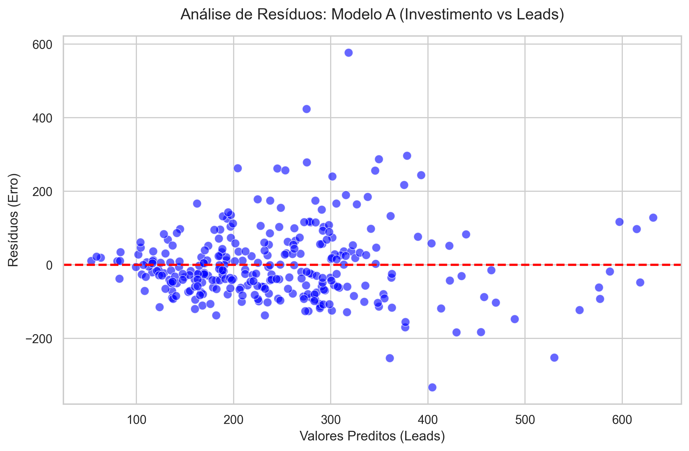
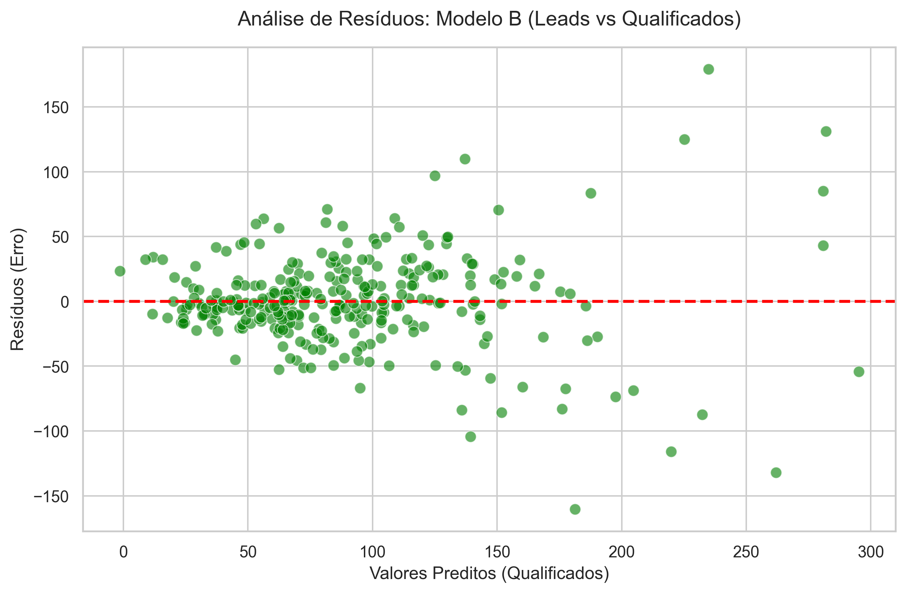

# Teste 02 — Heterocedasticidade

**Objetivo:** Verificar se a variância dos resíduos (erros do modelo) é constante para todos os níveis de valores previstos (Homocedasticidade) ou se ela se altera (Heterocedasticidade).

**Por que isso importa?**
Em modelos preditivos onde a heterocedasticidade está presente, as previsões para valores muito grandes (ex: investimentos gigantes) terão intervalos de confiança maiores (mais imprevisível) do que para valores menores.

---

## Metodologia e Teste Estatístico
Para ambos os modelos (Modelo A e Modelo B), aplicamos o **Teste de Breusch-Pagan** a partir dos resíduos do método dos Mínimos Quadrados Ordinários (OLS). 

- **Hipótese Nula ($H_0$):** A variância dos resíduos é homogênea (Homocedasticidade).
- **Hipótese Alternativa ($H_A$):** A variância dos resíduos é não-constante (Heterocedasticidade).

Se o p-valor for menor que `0.05`, rejeitamos $H_0$.

---

## 1. Modelo A (Investimento → Leads)

### Resultado
- **Teste Breusch-Pagan (p-valor):** `0.0000` *(< 0.05)*

### Análise Visual

### Conclusão do Modelo A
Existe heterocedasticidade confirmada. No gráfico, podemos observar um leve formato de "cone" abrindo-se para a direita: à medida que os valores previstos (Leads) aumentam, o espalhamento dos resíduos (erro) também se torna maior. 
- **Interpretação de Negócios:** Para investimentos baixos a médios, o número de leads gerados varia pouco em torno do estipulado. No entanto, para investimentos muito altos, o comportamento de mercado regional torna-se muito mais volátil, com resultados que tanto podem superar imensamente a expectativa quanto ficar bastante aquém da mesma.

---

## 2. Modelo B (Leads → Qualificados)

### Resultado
- **Teste Breusch-Pagan (p-valor):** `0.0000` *(< 0.05)*

### Análise Visual

### Conclusão do Modelo B
Existe heterocedasticidade clara. Novamente, quanto maior a predição de leads qualificados, maior a dispersão do erro. 
- **Interpretação de Negócios:** Volumes pequenos de leads geram qualificações de maneira altamente previsível. Mas quando o pipeline é inundado com milhares de leads simultâneos ($>500$), a capacidade de qualificação e os perfis do público variam amplamente, aumentando a margem de erro.

---

## Parecer Final e Próximos Passos
**O modelo "quebrou"?** Não! O $R^2$ e as predições continuam não-viesadas e consistentes, e o uso da regressão linear para esse negócio continua válido para o cálculo dos valores estimados médios.

No entanto, a heterocedasticidade sinaliza que **adicionar Intervalos de Confiança (Próximos Passos do README)** será de vital importância num futuro próximo, em vez de retornar apenas um valor determinístico (ex: "você vai gerar 364 leads"). O correto seria: "você vai gerar 364 leads, com margem variando entre 300 e 420". E essa margem deve ir se abrindo mais para investimentos maiores.
